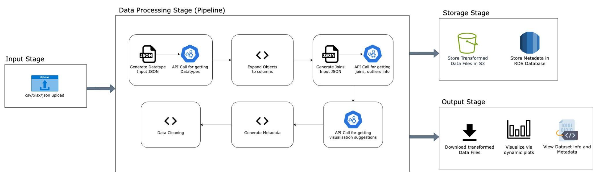

# Enterprise Data Transformation Pipeline Using Gen AI
## Team SAAS

## Overview

This tool is designed to be a comprehensive solution for data analysis, cleaning, transformation, and generating valuable business insights. Powered by TIAA’s advanced Generative AI, this pipeline streamlines data processing, allowing you to uncover trends and relationships effortlessly.

## What to Expect

With this fully automated system, you can handle any type of data seamlessly. Simply provide the data, and let the pipeline do the rest. It will automatically detect relationships, outliers, and extract actionable business insights. By the end of the process, you’ll receive detailed visualizations highlighting trends and correlations between data attributes. These insights can be leveraged to drive informed business decisions and foster growth.

## How to get started?

This application runs on Python and uses AWS S3 and RDS to store the transformed data and metadata.

### Minimum requirements / Prerequisites

OS: MacOS, Windows, Linux
Software: PostgreSQL

### Steps to follow

Run the following commands along the steps:

1. Go the project structure

    cd SAAS_REPO

2. Create a virtual environment

    
    python -m venv SAAS

3. Activate the vitual environment

    
    source SAAS/bin/activate

4. Install all the required libraries

    pip install -r requirements.txt

5. Set the access keys

6. Run the application

    streamlit run App/app.py

7. Upload the data files to analyze. If you don't have files, use the files we provided in the Data package. Make sure to upload all the files to get the most accurate analysis.

8. Wait for the processing to end.

9. Explore the application to view the metadata and various plots.
